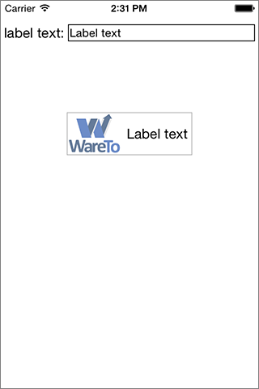

This Swift iOS project demonstrates some tricks with Interface Builder (IB) and class extensions to make your life easier.

The project also demonstrates how to create an image view and a text label that are grouped together so they are centered on the screen together, and re-center if the text contents of the label get larger or smaller.

The project lets you enter text into an UITextField. The app changes the label on a grouped label and image view, and the laout of the view keeps everything positioned correctly.

See the section titled "<u>*Centering a group of views on the screen*</u>", below.

##Using IBDesignable and IBInspectable
-----

<u>**Background:**</u>

in iOS, all UIView objects are backed by a Core Animation layer. Every UIView object has a property layer which is that object's layer.

Some properties like borderWidth and borderColor are properties of the layer, not of the view.

Thus you can't set a view's border color or border width directly from IB.

You can sort of do this using "User Defined Runtime Attributes" settings in IB, and specifying a key of "layer.borderWidth"

You can't do that with the view's layer's border color, however, because the color properties on a CALayer object are of type CGColorRef, not UIColor. 
The controls in IB for IB specify colors as UIColors, not CGColors.

This project solves all these problems.

It includes a simple file **UIViewExtensions.swift**. That file adds a couple of computed properties to all UIView objects: `borderWidth` and `borderColor`. Futher, it makes these properties directly settable in IB by adding the `@IBInspectable` qualifier.

The class extension looks like this:

	@IBDesignable
	extension UIView
	{
	  @IBInspectable
	  var borderWidth: CGFloat
	    {
	    get
	    {
	      return self.layer.borderWidth
	    }
	    set
	    {
	      self.layer.borderWidth = newValue
	    }
	  }
	  @IBInspectable
	  var borderColor: UIColor
	    {
	    get
	    {
	      return UIColor(CGColor: self.layer.borderColor)!
	    }
	    set
	    {
	      self.layer.borderColor = newValue.CGColor
	    }
	  }
	}
	
If you specify a `borderwidth` for a UIView, it sets the corresponding property on the view's layer. 
There is also a getter that lets you read your view's layer's borderWidth property

Likewize if you set/get a view's `borderColor` property it sets/gets the border color of the view's layer. In this case however it has to translate between the UIColor data type that IB uses and the `CGColorRef` type that is used for the border color of `CALayer` objects.

The **@IBDesignable** and **@IBInspectable** qualifiers do some cool Interface Builder magic.

Adding **@IBDesignable** to a property of a `UIView` object causes IB to display a control for getting/setting that property of the view. IB only supports a  small number of data types, so you have to make sure you use one of those types.

If you look at this app's view controller in IB, you'll see that the image view and label near the center of the view have a light gray box around them. That's the result of using the **@IBDesignable** setting.

The **@IBInspectable** qualifier does more magic. It causes IB to invoke your view class's code to draw the view right in the IB view. In the case of the `borderWith` and `borderColor` properties, we can set these properties on a view and they show up in IB. (Behind the scenes, IB simply generates "User Defined Runtime Atributes" for these settings, but you don't have to worry about entering a keypath or figuring out what data type to use, and IB shows you the name of hte property.)

##Centering a group of views on the screen
-----

This app shows how to create a group of views that include a text label, and keeps the group of views centered on the screen even if you change the text in the label.

The secret to this is to use a `UIView` as a container to hold the views that you want to position together. You then have to set up contstraints to get everything to size and position correctly.

In this app we have an image view and a label positioned together in a UIView which I will call the ContainerView.

###Constraints for the ContainerView

The ContainerView is positioned in it's superview (the view controller's content view) based on it's center. It's centered horizontally, and offset from the center of the superview vertically.

###Constraints for the image view
* The image view and label have a constraint that sets them to use the same vertical center. 
* The image view's leading edge is pinned to the ContainerView. 
* It's centered vertically in the ContainerView. 
* It has a fixed height and width. 
* It's bottom edge is pinned to the ContainerView.
* It's trailing edge is pinned 5 points from the leading edge of the lable view.

###Constraints for the label view
* The label view's leading edge is pinned to 5 points from the trailing edge of the image view.
* It's trailing edge is pinned to 5 points from the ContainerView
* It's centered to the center of the image view. Since the image view is centered in the ContainerView. so is the  label.

**So here's how it all works**:

The ContainerView is centered relative to the center of it's superview. The ContainerView does not have a size of it's own, so it takes the size of it's subviews.

The ContainerView's subviews are all pinned to the edges of the containerView. The image view has a fixed size, but the `UILabel` does not. If you change the text of the UILabel, it resizes to fit the new text.

When that happens it triggers the ContainerView to update it's layout. The ContainerView grows or shrinks as needed to fit the image view, label, and spacing specified in the constraints. The ContainerView's constraints in it's superview keep it centered as it grows and shrinks due to the label growing and shrinking.

The app screen looks like this:

